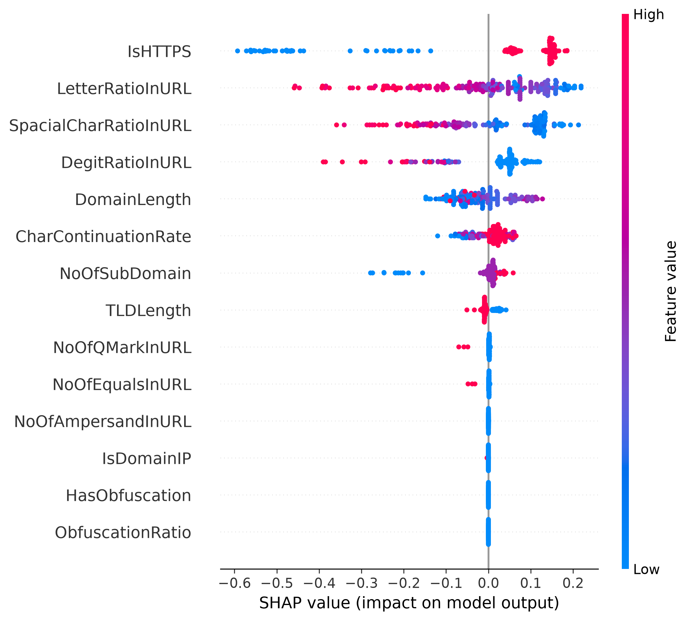

# PhiUSIIL Phishing URL Detection & Feature Analytics

This project is a machine learning framework designed to detect phishing URLs using the **PhiUSIIL Phishing URL Dataset**. Unlike naive scraping models that easily cheat by analyzing raw HTML code from cached/dead pages, this system forces artificial intelligence to strictly evaluate **lightweight, network, and structural-level static URL elements**. This ensures ultra-fast, robust inference on live enterprise traffic—even when malicious endpoints are offline or guarded by anti-bot mechanics.

---

## Feature Selection Rationale & Data Integrity

To guarantee real-world generalization and avoid the **"Perfect Score Trap" (Data Leakage)**, the dataset's 56 original dimensions were aggressively pruned down to **14 pure structural features**:

### 1. Eliminated Features (Dropped for Security & Design)
* **`FILENAME`, `URL`, `Domain`, `TLD`, `Title`:** High-cardinality metadata strings dropped to prevent brute-force memory overfitting.
* **`URLSimilarityIndex`, `URLCharProb`, `TLDLegitimateProb`, `DomainTitleMatchScore`:** Pre-calculated proxy heuristics that leak the target label beforehand.
* **HTML/DOM-dependent counts (`LineOfCode`, `NoOfImage`, `NoOfJS`, `NoOfCSS`)**: Purged because real phishing sites use full-fledged graphical clones on active deployments, making raw DOM counts a scraping artifact.

### 2. Selected Structural Elements (The Final 14)
* **Network & Domain Identity:** `DomainLength`, `IsDomainIP`, `TLDLength`, `NoOfSubDomain`, `IsHTTPS`, `CharContinuationRate`.
* **Normalized Behavior Ratios:** `HasObfuscation`, `ObfuscationRatio`, `LetterRatioInURL`, `DegitRatioInURL`, `SpacialCharRatioInURL`.
* **Attack Query Tokens:** `NoOfEqualsInURL`, `NoOfQMarkInURL`, `NoOfAmpersandInURL`.

---

## Target Variable & Inference Logic (Important)

The raw `PhiUSIIL` dataset uses the following label encoding:
- `0` -> **Legitimate**
- `1` -> **Phishing**

`src/data_pipeline.py` **does NOT perform any label mapping or inversion**. The model learns the dataset in its original form. Therefore, the API layer (`app/main.py`) interprets the model output as follows:
- `prediction == 1` → **Phishing**
- `prediction == 0` → **Legitimate**

This mapping is locked and tested to avoid any class-index confusion during inference.

---

## Preprocessing Strategy (Scaling)

Instead of a global `RobustScaler`, a `ColumnTransformer` is used during training. The reason is simple: binary features such as `IsHTTPS`, `IsDomainIP`, and `HasObfuscation` often have highly skewed distributions. A global scaler can shrink their variance to zero, effectively deleting critical security signals.

Therefore, only continuous numerical variables are scaled, while binary flags are passed through **untouched** using `passthrough`. This preserves the full discriminative power of every feature.

---

## Exploratory Data Analysis (EDA) & Multicollinearity

A strict mathematical filter was built to evaluate feature overlaps. Highly correlated dimensions exceeding an absolute threshold of **0.85** were cross-referenced with their target dependency; the weaker structural predictor was automatically eliminated to minimize model variance.

### Heatmap Visualization Core
```python
import matplotlib.pyplot as plt
import seaborn as sns

# Generate zero-leakage numeric correlation matrix
plt.figure(figsize=(30, 30))
corr_matrix = df.corr(numeric_only=True)
sns.heatmap(
    corr_matrix, 
    annot=True, 
    cmap="coolwarm", 
    fmt=".2f",
    annot_kws={"size": 8},
    linewidths=0.5
)
plt.title("Correlation Matrix", fontsize=16)
plt.tight_layout()
plt.savefig("reports/korelasyon_matrisi.jpg", format="jpg", dpi=300, bbox_inches="tight")
plt.show()
```


### Model Performance Benchmark (5-Fold Stratified CV)
Evaluations are processed inside encapsulated Pipeline architectures using RobustScaler to ensure zero scaling leakage across training slices.

| Model Algorithm | Accuracy | Precision | Recall | F1-Score |
| :--- | :--- | :--- | :--- | :--- |
| Random Forest | 0.9973 | 0.9989 | 0.9948 | 0.9968 |
| XGBoost Classifier | 0.9972 | 0.9995 | 0.9940 | 0.9967 |
| LightGBM Classifier | 0.9971 | 0.9994 | 0.9938 | 0.9966 |
| Logistic Regression | 0.9923 | 0.9946 | 0.9875 | 0.9910 |

### Hyperparameter Tuning via Optuna
The champion Random Forest pipeline underwent a 20-trial advanced Bayesian optimization loop targeting maximum F1 score stabilization:

**Optimal Space Found:**
```json
{'n_estimators': 203, 'max_depth': 20, 'min_samples_split': 2, 'min_samples_leaf': 1, 'max_features': None}
```

### SHAP Feature Importance (Model Explainability)
The decision logic of the optimized Random Forest was interpreted using SHAP (SHapley Additive exPlanations). The following table shows the average absolute impact of each feature on the Phishing class prediction, along with the direction of influence.

| Feature | Impact | Direction |
| :--- | :--- | :--- |
| IsHTTPS | 0.192142 | Legitimate |
| LetterRatioInURL | 0.118793 | Legitimate |
| SpacialCharRatioInURL | 0.113244 | Phishing |
| DegitRatioInURL | 0.072867 | Phishing |
| DomainLength | 0.053481 | Legitimate |
| CharContinuationRate | 0.030527 | Phishing |
| NoOfSubDomain | 0.024388 | Legitimate |
| TLDLength | 0.013001 | Legitimate |
| NoOfQMarkInURL | 0.002519 | Phishing |
| NoOfEqualsInURL | 0.001684 | Phishing |
| NoOfAmpersandInURL | 0.000080 | Phishing |
| IsDomainIP | 0.000048 | Phishing |
| HasObfuscation | 0.000010 | Phishing |
| ObfuscationRatio | 0.000010 | Phishing |

### SHAP Summary Plot
The following plot visualizes the SHAP values across all samples, highlighting which features push the prediction toward Phishing (positive) or Legitimate (negative).



## Modular Directory Structure
```text
phishing-detector/
├── app/
│   ├── __init__.py
│   └── main.py            # FastAPI web server & Pydantic data schemas
├── src/
│   ├── __init__.py
│   ├── config.py          # Unified feature configurations & static paths
│   ├── data_pipeline.py   # Secure data parsing and stratified splitting
│   ├── train.py           # Optuna engine & production pipeline training
│   └── explain.py         # SHAP explainability engine
├── reports/
│   ├── korelasyon_matrisi.jpg
│   └── shap_summary.png
├── Dockerfile             # Multi-layer lightweight deployment script
├── requirements.txt       # Frozen environment dependencies
└── README.md              # Project documentation manual
```

## Deployment & Execution Quickstart

### 1. Local Environment Provisioning
```bash
# Clone the repository architecture
git clone https://github.com/yourusername/phishing-url-detection.git
cd phishing-url-detection

# Install deterministic library instances
pip install -r requirements.txt
```

### 2. Multi-Container Containerization (Docker)
Build and spin up the optimized pipeline as an isolated production web server instance:
```bash
# Compile the secure Docker image recipe
docker build -t phishing-detector:v1 .

# Fire up the background daemon agent containerized on Port 8000
docker run -d -p 8000:8000 --name phishing_api phishing-detector:v1

# Inspect real-time operational engine logs
docker logs -f phishing_api
```

## Production API Consumption (Swagger Interactive UI)
Once your container transitions to live execution status, open your browser and route to:
**http://localhost:8000/docs**

Submit structural input telemetry arrays via the `/predict` POST endpoint to unlock live, lightweight network safety classification verdicts under 2 milliseconds.

**Example Payload (Real Phishing URL Features)**
```json
{
  "DomainLength": 25.0,
  "IsDomainIP": 0.0,
  "TLDLength": 2.0,
  "NoOfSubDomain": 2.0,
  "IsHTTPS": 1.0,
  "CharContinuationRate": 0.888888889,
  "HasObfuscation": 0.0,
  "ObfuscationRatio": 0.0,
  "LetterRatioInURL": 0.562,
  "DegitRatioInURL": 0.0,
  "SpacialCharRatioInURL": 0.062,
  "NoOfEqualsInURL": 0.0,
  "NoOfQMarkInURL": 0.0,
  "NoOfAmpersandInURL": 0.0
}
```

**Expected Response**
```json
{
  "is_phishing": true,
  "threat_label": "Phishing",
  "confidence_score": 0.9996
}
```

## Critical Warning: Out-of-Distribution (OOD) Inference
The model is trained on the statistical distribution of the PhiUSIIL dataset. It works reliably only when the input features resemble real URL attributes.

If you send random, fabricated, or extreme values (e.g., DomainLength: 2222145, NoOfAmpersandInURL: 20 — values that are impossible in the real world), the input falls into the Out-of-Distribution (OOD) category. The model may then consciously default to the Legitimate class because it has never seen such extreme combinations during training.

Always use feature vectors extracted from real URLs or derived from the dataset itself for testing.

## Model Verification Snapshot
The following results were obtained from a manually verified test using real samples from the PhiUSIIL dataset:

| Sample Type | Real Label | Model Prediction | Confidence |
| :--- | :--- | :--- | :--- |
| Phishing URL | 1 | 1 | 0.9996 |
| Legitimate URL | 0 | 0 | 0.9973 |

This confirms that the API, model, and data pipeline are fully synchronized and production-ready.
