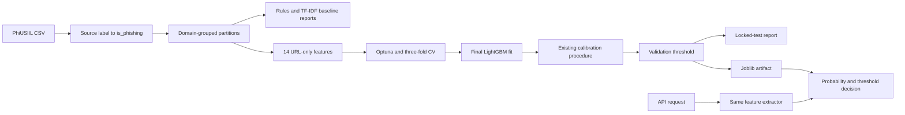

# Phishing URL Detection

## Overview

An educational machine-learning project comparing a lexical rule baseline,
character TF-IDF/logistic regression, and LightGBM on the PhiUSIIL dataset.
The internal positive class is **phishing**.

The LightGBM workflow extracts 14 URL-only features, searches hyperparameters
with Optuna, applies the existing calibration procedure, selects a validation
threshold, and saves a Joblib artifact for a small FastAPI endpoint.

## Scope and limitations

- Features come from URL text. The classifier does not fetch pages, inspect
  HTML/DOM, query DNS, or validate certificates.
- Dataset scores do not establish performance on newly encountered campaigns.
  Protocol/prefix shortcuts and false positives are known concerns described
  in the archived [model card](reports/model_card.md).
- Enterprise readiness, generalization, memory overhead and sub-2 ms latency
  were not independently established.
- Readability changes preserve feature values, labels, model settings, threshold
  selection, artifact fields and HTTP response structure. Methodological issues
  are documented separately.
- The model card is retained verbatim. Its production claims and suggested
  prefix-normalization mitigation are unverified; altering URL prefixes changes
  features and requires separate evaluation.

## Architecture and workflow


```mermaid
flowchart LR
    CSV[PhiUSIIL CSV] --> Labels[Source label to is_phishing]
    Labels --> Split[Domain-grouped partitions]
    Split --> Baselines[Rules and TF-IDF baseline reports]
    Split --> Features[14 URL-only features]
    Features --> CV[Optuna and three-fold CV]
    CV --> Fit[Final LightGBM fit]
    Fit --> Calibration[Existing calibration procedure]
    Calibration --> Threshold[Validation threshold]
    Threshold --> Test[Locked-test report]
    Threshold --> Artifact[Joblib artifact]
    URL[API request] --> Extract[Same feature extractor]
    Artifact --> API[Probability and threshold decision]
    Extract --> API
```

Ordinary functions coordinate these steps. The small model classes expose
familiar `fit`, `predict` and `predict_proba` methods where applicable.

## Project layout

```text
phishing-url-detection/
├── app/main.py                   # HTTP input/output and artifact loading
├── scripts/run_experiment.py     # CLI entry point
├── src/phishing_guard/
│   ├── experiment.py             # Six ordered experiment steps
│   ├── data/                     # Labels and domain-grouped splits
│   ├── features/url_lexical.py    # URL-to-feature matrix
│   └── modeling/                 # Baselines, training, calibration, artifacts
├── reports/model_card.md         # Unmodified historical model card
├── docs/API_REVIEW.md            # API contract and known limitations
├── docs/VERIFICATION_RESULTS.json # Recorded verification checks
├── requirements.txt             # Minimum versions, not a lock file
└── run_experiment.py             # Compatibility entry point
```

No empty configuration folder is added. `data/` and `models/` are local runtime
locations; the dataset and trained artifact are not included in this snapshot.

## Data and artifacts

Place the CSV at `data/raw/phiusiil/PhiUSIIL_Phishing_URL_Dataset.csv`.
`prepare_frozen_splits` expects **`URL`** and lowercase **`label`**.
The lower-level `transform_labels` defaults to uppercase `Label` when called
directly; its argument selects a different column.

| Source label | Internal `is_phishing` | Meaning |
|---|---|---|
| 0 | 1 | Phishing |
| 1 | 0 | Legitimate |

The existing code maps every nonzero/unknown source value to legitimate rather
than rejecting it. That validation limitation is preserved.
Missing URL handling depends on the pandas string-conversion behavior; in the
checked pandas 3 environment, a missing value remains null and feature extraction
raises `TypeError`. The HTTP request schema requires a string.

These are the exact ordered features. Historical names stay for artifact
compatibility; use their actual calculations when interpreting the model.

| Stored column | Actual calculation |
|---|---|
| `URLLength` | String length |
| `NoOfLettersInURL` | Count of `.` |
| `NoOfEqualsInURL` | Count of `-` |
| `NoOfQMarkInURL` | Count of `?` |
| `NoOfOtherSpecialCharsInURL` | Count of `=` |
| `NoOfAmpersandInURL` | Count of `_` |
| `NoOfHashInURL` | Count of `/` |
| `NoOfDigitsInURL` | Count of Unicode digit characters |
| `NoOfEqualsInURL_letter_count` | Count of Unicode alphabetic characters |
| `is_https` | Lowercased URL starts with `https` |
| `is_ip_host` | Digits-and-dots host heuristic, not full IP validation |
| `has_at_symbol` | URL contains `@` |
| `subdomain_depth` | `max(0, total URL dot count - 1)` |
| `digit_ratio` | Digit count / (`URLLength + 1e-5`) |

Earlier documentation listed `DomainLength`, `IsDomainIP`, `TLDLength`,
`NoOfSubDomain`, `IsHTTPS`, `CharContinuationRate`, `HasObfuscation`,
`ObfuscationRatio`, `LetterRatioInURL`, `DegitRatioInURL`, `SpacialCharRatioInURL`,
`NoOfEqualsInURL`, `NoOfQMarkInURL` and `NoOfAmpersandInURL`. That list did not
describe the extractor. The claimed `ColumnTransformer`/`RobustScaler` is also
absent: current training directly uses the extracted matrix without scaling.

Other CSV columns are not LightGBM inputs. The original feature-selection
rationale excluded raw metadata (`FILENAME`, `URL`, `Domain`, `TLD`, `Title`),
proxy scores (`URLSimilarityIndex`, `URLCharProb`, `TLDLegitimateProb`,
`DomainTitleMatchScore`), and HTML counts (`LineOfCode`, `NoOfImage`, `NoOfJS`,
`NoOfCSS`). These are design choices, not proof that every excluded field leaks
the label.

The default artifact is `models/url_only_lgb_v2.0.0.joblib`. Its fields are
`model`, `feature_columns`, `threshold`, `version` and `model_type`.
Only load trusted Joblib files: deserialization can execute Python code.

## Setup

Use the repository root as the working directory. The checked interpreter was Python 3.12;
requirements specify minimum versions rather than a frozen environment.
LightGBM must be at least 4.7.0 for the preserved `eval_X`/`eval_y` training API;
the requirement now reflects that compatibility constraint.

```bash
git clone https://github.com/YavuzahmetR/phishing-url-detection.git
cd phishing-url-detection
python -m venv .venv
```

Activate with `.venv\Scripts\Activate.ps1` on PowerShell or
`source .venv/bin/activate` on Linux/macOS, then install:

```bash
python -m pip install -r requirements.txt
```

See the refactor notes for the environment actually checked. Minimum versions
alone do not guarantee compatibility with the training API.

## Usage

```bash
python scripts/run_experiment.py
# Original command remains supported:
python run_experiment.py
```

This trains, prints baseline/candidate reports, calibrates and writes an artifact.
The CSV must exist. Seed 42, 30 Optuna trials and `n_jobs=-1` are preserved.
Parallel search is not guaranteed to repeat trial order exactly.

After supplying a trusted artifact:

```bash
uvicorn app.main:app --reload --port 8000
```

`MODEL_PATH` overrides the artifact path. Interactive API: `http://localhost:8000/docs`.

Example request:

```json
{"url": "http://secure-bank-update-verify-checkpoint.com"}
```

Historical illustrative response, not a guaranteed prediction:

```json
{
  "is_phishing": true,
  "probability": 0.9999381527163119,
  "threshold": 0.9514251634442327,
  "model_version": "v2.0.0"
}
```

Input longer than 2048 characters is rejected. Missing model: HTTP 503.
`/health` returns `{"status":"ok"}` even without an artifact; it is not a model
readiness check. Existing prediction errors return HTTP 500.
See [API review and first-run steps](docs/API_REVIEW.md) for measured responses
and the remaining service limitations.

## Evaluation protocol

- `tldextract` derives registrable domains. `GroupShuffleSplit` separates domains
  among train, calibration, validation and locked test.
- Nominal **group** proportions are 70/10/10/10; row proportions can differ.
  Failed extraction uses a shared `unknown_domain` group.
- Baselines are reported on validation. LightGBM optimizes mean average
  precision (called PR-AUC in console output) using three grouped stratified
  folds when groups exist, otherwise ordinary stratified folds.
- CV uses early stopping after 30 rounds and a 1000-tree limit. The final fit
  retains its original estimator defaults; it does not copy that limit.
- Existing `CalibratedClassifierCV(cv=None, ensemble=False)` is retained. It fits
  on calibration data rather than freezing the already trained estimator.
- Threshold selection chooses highest precision among candidates reaching 0.95
  validation phishing recall. Equal precision retains the first candidate;
  if none qualifies, threshold stays 0.5. Classification uses `>=`.
- The calibrated model is reported on locked test, including average precision.
  A historically inspected test is not unseen data again.

## Results and interpretation

The table retains the original README's **rounded historical values**. No raw
experiment log or trained artifact is bundled to recompute this matrix or
establish a common split for every row.

| Model | Accuracy | Phishing precision | Phishing recall | F1 |
|---|---:|---:|---:|---:|
| Lexical heuristic | 0.68 | 0.83 | 0.14 | 0.24 |
| Character n-gram logistic regression | 1.00 | 1.00 | 0.99 | 0.99 |
| LightGBM + sigmoid calibration | 0.98 | 1.00 | 0.96 | 0.98 |

The model card attributes the candidate accuracy, precision and recall to locked
test. The original README mixed validation/evaluation descriptions. Baseline
rows should not be treated as a confirmed locked-test comparison.

Recorded Optuna parameter subset:

```json
{"learning_rate": 0.0904, "num_leaves": 69, "max_depth": 8,
 "min_child_samples": 100, "subsample": 0.9810}
```

The reported threshold is `0.9514`; it is not hardcoded into training.
Heuristic recall 0.14 corresponds to approximately 86% missed phishing examples
in that report. A high logistic-regression score alone does not prove overfitting
or high memory consumption. Rounded precision 1.00 does not imply an error-free
service. Latency, memory, external data and shortcut effects need measurements.

## Verification

The repository does not distribute a software test suite or test/lint CI workflow.
Historical verification records remain
as evidence of the earlier readability pass; they are not runnable test suites.
For a quick local syntax check, run from the repository root:

```bash
python -m compileall -q src app scripts run_experiment.py
```

Use `/docs` to try the API with your own supplied model artifact.
The cleanup checks compare real-artifact HTTP responses before and after removal;
they do not retrain the dataset or replace the scientific locked-test evaluation.
See [cleanup results](docs/CLEANUP_RESULTS.json) and [API review](docs/API_REVIEW.md).
See [verification results](docs/VERIFICATION_RESULTS.json) and
[HTTP verification](docs/HTTP_VERIFICATION.json) for the recorded checks.
Reports are unchanged and the original dataset is not retrained here.

## Design choices

Core code is in `src/`, CLI in `scripts/`, reports in `reports/`, explanations in
`docs/`. Explicit module imports work without package `__init__.py` files.
Small wrappers retain old commands.
Separate method repairs must be evaluated independently from readability
changes so that new model results are not confused with layout changes.
